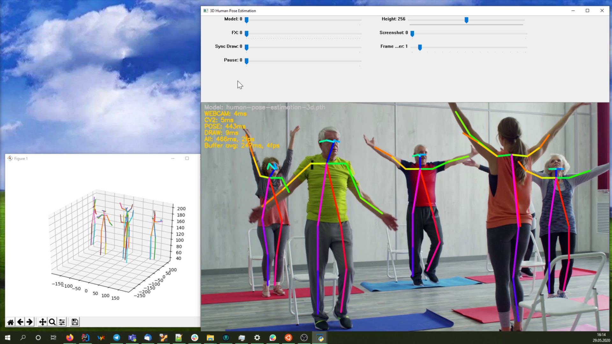

# 3D Human Pose Estimation (Jetson Nano) 

3D-Personendaten aus einem 2D-Bild ohne Tiefendaten zu erlangen, ist zurzeit noch schwierig. Mithilfe von neuronalen Netzwerken wird dies jedoch vereinfacht. Ziel ist es nun, herauszufinden, ob in mit Hilfe eines Jetson Nano zufriedenstellende Ergebnisse erzielt werden können. Dabei werden sowohl die Genauigkeit der Ergebnisse als auch die Performance des mobilen Einplatinen-Computer getestet.



> This work was done by Marc Schuler & Robert Fuchs during the IWI276 Autonome Systeme Labor at the Karlsruhe University of Applied Sciences (Hochschule Karlruhe - Technik und Wirtschaft) in SS 2020.

## Table of Contents

* [Requirements](#requirements)
* [Prerequisites](#prerequisites)
* [Pre-trained model](#pre-trained-model)
* [Running](#running)
* [Troubleshooting](#troubleshooting)
* [Acknowledgments](#acknowledgments)

## Requirements

- Python >=3.5
- CMake >=3.1
- C++ Compiler
- OpenCV >=4.0
- Jetson Nano 
- Jetpack 4.2

## Prerequisites

1. Create a virtual environment and activate it

```
python -m venv venv
source venv/bin/activate
```

2. Make sure to install the required python packages 

```
pip install -r requirements.txt
```

3. Build the `pose_extractor` module

```
python setup.py build_ext
```

4. Add build folder to the `PYTHONPATH`

```
export PYTHONPATH=pose_extractor/build/:$PYTHONPATH
```

### Setup on the Jetson Nano

The steps are theoretically the same as above, however you will most likely have issues installing the required dependencies.
Here is a list with some useful links and tips: 

- Sometimes dependencies need to be installed in a certain order
- [Installing PyTorch](https://forums.developer.nvidia.com/t/pytorch-for-jetson-nano-version-1-5-0-now-available/72048)
- `Matplotlib` requires *FreeType2* to be installed on the system: `sudo apt install libfreetype6-dev`
- `OpenCV` and `Torchvision` can't be installed directly inside a virtual environment.
  Install both globally on the system via `pip3 install --user <python_package>` and then copy them from the system dependency directory to the virtual environment dependency directory. Something like this:

  ```
  cp -r /usr/local/lib/python3.6/dist-packages/torchvision ~/3d-human-pose-estimation/venv/lib/python3.6/site-packages/
  ```

## Pre-trained models <a name="pre-trained-models"/>

Pre-trained model is available at `models/human-pose-estimation-3d.pth`.

## Running

To run the demo, simply execute the `main.py`. This will spawn a GUI with adjustable sliders and use your default webcam as an input stream.

```
python main.py
```

You can also use a video file (or image) instead of the webcam. Simply pass the path to the file as an argument: 

```
python main.py /path/to/video-file/
```

## Troubleshooting

> UserWarning: Matplotlib is currently using agg, which is a non-GUI backend, so cannot show the figure.

If you encounter the error above, you need to install some additional dependencies on your machine. Please see:

- [StackOverflow Thread](https://stackoverflow.com/questions/56656777/userwarning-matplotlib-is-currently-using-agg-which-is-a-non-gui-backend-so)
- [Arch Linux Forum Thread](https://bbs.archlinux.org/viewtopic.php?pid=1885317#p1885317)

## Acknowledgments

This repo is based on
  - [lightweight human pose estimation 3d](https://github.com/Daniil-Osokin/lightweight-human-pose-estimation-3d-demo.pytorch)

Thanks to the original authors for their work!

## Contact

Please email `mickael.cormier AT iosb.fraunhofer.de` for further questions.
